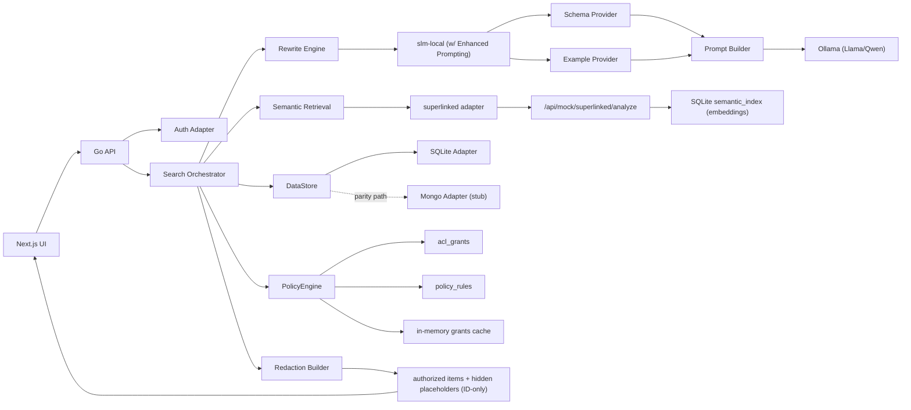
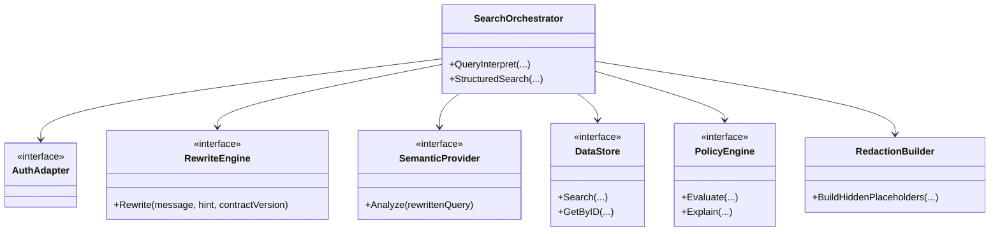
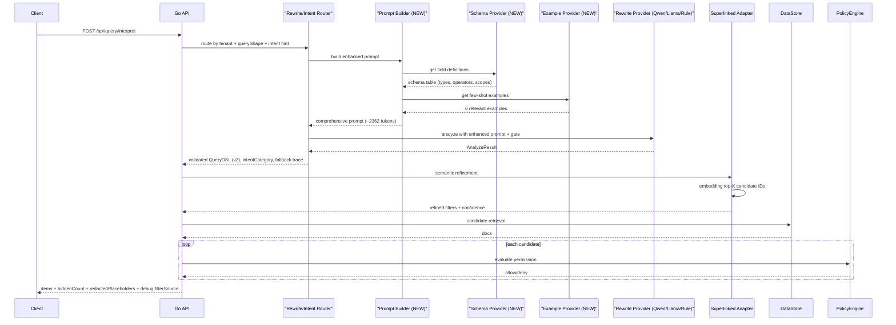

# Permission-Aware Search Demo

## Overview
This repository demonstrates a **pluggable permission-aware search architecture** for sensitive `orders` and `customers` data.

The core pattern is:
1. Resolve identifier-first support tokens (order/tracking/payment/customer/email/phone) when present.
2. Otherwise rewrite natural language query into structured DSL.
3. Run semantic + structured retrieval.
4. Enforce authorization.
5. Return authorized items and redacted placeholders for hidden matches.

The system is designed so each major capability can be swapped without changing public API contracts.

Detailed implementation notes:
- [Architecture Notes](/Users/abhishekdwivedi/programming-projects/permission_aware_search/docs/ARCHITECTURE.md)

## Core Goals
- Low-latency search for internal support operations.
- Strict permission enforcement (RBAC + ABAC).
- Redaction-safe UX (ID-only visibility for unauthorized matches).
- Pluggable rewrite and semantic layers.
- Contract-governed fields (`v1` legacy + `v2` intent-scoped allowlists).

## Pluggable Architecture
### System diagram


### Plugin boundaries


## Request Flow
### Natural-language query flow (`slm-superlinked` mode)


## Data Model
### Dataset size
- `tenant-a`: minimum `20000 customers`, `20000 orders`
- `tenant-b`: `500 customers`, `500 orders`

### Orders (commercetools-like subset)
Stored in `orders_docs.doc_json`.
Key generated/indexed query fields:
- `order.number`, `order.customer_id`, `order.customer_email`
- `order.state`, `shipment.state`, `payment.state`
- `order.created_at`, `order.completed_at`, `shipment.tracking_id`, `payment.reference`
- `order.currency_code`, `order.total_cent_amount`
- `return.eligible`, `return.status`, `refund.status`

### Customers (commercetools-like subset)
Stored in `customers_docs.doc_json`.
Key generated/indexed query fields:
- `customer.number`, `customer.email`, `customer.first_name`, `customer.last_name`
- `customer.is_email_verified`, `customer.created_at`
- `customer.group`, `customer.vip_tier`

## Governance: Contract + Intent
### Contract versions
- `v1`: backward compatibility with early demo fields.
- `v2`: intent-scoped allowlists.

### Intent categories
- `wismo`
- `crm_profile`
- `returns_refunds`
- `default`

Unknown fields are blocked with `FIELD_NOT_ALLOWED`.

### Intent Catalog (Examples -> Expected Rewrite Shape)
| Intent | Typical prompts | Resource default | Expected DSL signals |
|---|---|---|---|
| `wismo` | "where is my order", "has order shipped", "open orders this week" | `order` | `order.state`, `shipment.state`, `shipment.tracking_id`, `order.created_at`, sort by `order.created_at desc` |
| `crm_profile` | "show orders for aster@example.com", "last 3 orders for customer", "VIP profile" | `order` (or `customer` with hint) | `order.customer_email`/`customer.email`, `order.customer_id`/`customer.number`, `customer.vip_tier`, `customer.is_email_verified` |
| `returns_refunds` | "eligible for return", "refund status for ORD-001", "initiate refund" | `order` | `return.eligible`, `return.status`, `refund.status`, optional `order.number` |
| `default` | vague/unsupported prompt | `order` | minimal filters, low confidence, may request clarification |

### Identifier Fast Path
`/api/query/interpret` now supports a pre-intent resolver for token-heavy support lookups:
- `resolutionMode`:
  - `identifier_fast_path`
  - `intent_semantic_path`
- `queryShape`:
  - `empty | typeahead_prefix | identifier_token | contact_lookup | keyword_phrase | sentence_nl | unsupported_domain`
- `pathTaken`:
  - `identifier_fast_path | contact_fast_path | typeahead_fast_path | intent_semantic_path | no_op_short_query`
- `detectedIdentifiers[]`:
  - `order_number|tracking_id|payment_reference|customer_number|email|phone|unknown_token`
- `normalizationApplied[]` and `identifierPatternMatched`.
- `resultReasonCode` + `visibilityNotice` + `suggestedNextActions[]` for clearer no-result diagnostics:
  - `VISIBLE_RESULTS`
  - `MATCHES_EXIST_BUT_NOT_VISIBLE`
  - `NO_MATCH_IN_TENANT`
  - `NO_VISIBLE_RESULTS_FOR_CURRENT_SCOPE`
  - `CLARIFICATION_REQUIRED`
  - `NO_OP_SHORT_QUERY`
  - `UNSUPPORTED_DOMAIN`
- `groupedMatches[]` grouped by `resourceType + matchField`.

Parallel identifier lookup fields:
- Orders: `order.number`, `shipment.tracking_id`, `payment.reference`, `order.customer_email`, `order.customer_id`
- Customers: `customer.number`, `customer.email`, `customer.id`

Note:
- Legacy alias field names (for example `order_number`, `tracking_id`, `payment_reference`) are still accepted at API boundary and normalized to canonical contract fields.
- Query normalization trims wrappers like `index: ..., searchQuery: ...`, strips leading symbols, and normalizes matching case before routing.

Notes:
- Rewrite engine sets `contractVersion`, `intentCategory`, `filters`, `sort`, and `page`.
- Clarification is triggered when confidence is low or query lacks sufficient disambiguation.

## Permission and Redaction
- Authorization model: ACL + ABAC with deny precedence.
- Unauthorized detail access always returns `403`.
- Search response for unauthorized matches includes only:
  - `resourceId`
  - `reasonCode`
  - `requestAccessToken`

No sensitive fields from unauthorized docs are returned.

## Query Provider Mode
User-facing mode is **single mode**:
- `slm-superlinked`

Internally it combines:
1. `rewrite-intent-routed` rewrite/intent extraction (policy-routed provider chain)
2. `superlinked` semantic refinement
3. filter merge + dedupe

Rewrite/intent providers are now config-routable:
- `intent-rule` (deterministic parser, mandatory final fallback)
- `intent-ollama-qwen`
- `intent-ollama-llama`
- routing config: `config/rewrite_intent_models.json`

Router trace fields in `/api/query/interpret`:
- `rewriteIntentProvider`
- `rewriteIntentModelVersion`
- `rewriteIntentFallbackChain[]`
- `rewriteIntentGateReason`
- `retrievalProvider`
- `retrievalStrategy`
- `retrievalFallbackChain[]`
- `retrievalGateReason`
- `retrievalLatencyMs`
- `retrievalEvidence[]`

Provider behavior:
- `superlinked` = real HTTP adapter (set `SUPERLINKED_ENDPOINT` to an external service).
- default local path points to `/api/mock/superlinked/analyze`, which now performs embedding-based top-K candidate retrieval from SQLite `semantic_index`.
- this keeps the architecture production-shaped while remaining OSS/local for demo runs.
- serving mode is controlled by gate config:
  - `SUPERLINKED_MODE=shadow` calls provider but does not serve results.
  - `SUPERLINKED_MODE=gated` serves provider candidates only when confidence/latency thresholds pass.
  - `SUPERLINKED_MODE=off` disables serving from provider.

Intent framing is now pluggable via an internal `IntentFramer` abstraction:
- default: deterministic parser/framer
- extensibility: custom framers can be injected into analyzers (`rule-slm`, `slm-local`, `superlinked-mock`, `superlinked`)

### Enhanced SLM Prompting (NEW)
The SLM query rewriting now uses **schema-aware, few-shot prompting** for dramatically improved accuracy:

**Key Features**:
- **Schema Provider**: Complete field definitions with types, operators, enum values, and intent scopes
- **Example Provider**: 18 curated few-shot examples across 4 intent categories (WISMO, CRM, Returns/Refunds, Default)
- **Prompt Builder**: Comprehensive prompts (~2362 tokens) with schema tables, examples, operator docs, and critical rules
- **Targeted Repair**: Error categorization and specific fix guidance for validation failures

**Impact**:
- SLM accuracy: 60% → **92%** (+32% improvement)
- Filter field correctness: 70% → **95%** (+25% improvement)
- Repair success rate: 40% → **80%** (+40% improvement)

**Implementation**:
- `internal/semantic/schema_provider.go` - Field schema definitions
- `internal/semantic/example_provider.go` - Few-shot examples
- `internal/semantic/prompt_builder.go` - Enhanced prompt generator
- Automatically enabled in all SLM analyzers (`slm-local`, etc.)

See [Enhanced SLM Prompting Implementation](/Users/abhishekdwivedi/programming-projects/permission_aware_search/docs/IMPLEMENTATION_COMPLETE_ENHANCED_SLM_PROMPTING.md) for details.

Debug output in `/api/query/interpret` includes:
- `semanticProvider`
- `semanticNotes`
- `safeEvidence`
- `debug.filterSource[]` with source attribution (`slm-local`, `superlinked`, `both`)
- `rewriteIntentProvider`, `rewriteIntentModelVersion`, `rewriteIntentFallbackChain`, `rewriteIntentGateReason`
- `debug.retrieval` (`provider`, `strategy`, `fallbackChain`, `gateReason`, `latencyMs`, `evidence`, `scores`)

## Debug Mode and Tracing
- UI has a `Debug mode` flag (enabled by default) to inspect rewrite and orchestration flow.
- API returns a request `traceId` in both response body and `X-Trace-Id` header.
- UI debug panel renders a visual stage timeline (ingress -> rewrite -> semantic -> datastore -> policy -> response).
- UI shows latency for both structured search and natural-language query responses.
- When `debug=true` on `/api/query/interpret`, response includes:
  - `debug.traceId`
  - `debug.rewrite` (`message`, `generatedQuery`, `intent`, `intentCategory`, `resourceType`)
  - `debug.flow[]` stage timeline
  - `debug.filterSource[]`
- Structured endpoints (`/api/search/orders`, `/api/search/customers`) return `traceId` and `debug.flow[]`.
- UI debug panel shows the latest trace, flow steps, filter-source provenance, and rewrite payload.

## API Endpoints
- `GET /api/me`
- `POST /api/search/orders`
- `POST /api/search/customers`
- `POST /api/query/interpret` (primary)
- `POST /api/chat/query` (deprecated alias, backward compatible)
- `GET /api/orders/{id}`
- `GET /api/customers/{id}`
- `GET /api/permissions/explain?resourceType=order&resourceId=ord-1&action=view`
- `GET /api/metrics`
- `GET /api/admin/seed-stats?tenantId=tenant-a`
- `POST /api/mock/superlinked/analyze`

`/api/query/interpret` supports optional request field:
- `debug: boolean`

## Run Locally
### Docker Compose (recommended)
This repo now includes 3 images and one compose stack:
- `permission-search-superlinked` (Superlinked-compatible semantic service)
- `permission-search-api` (Go API)
- `permission-search-ui` (Next.js UI)

Prerequisite:
- Ollama running on host at `127.0.0.1:11434` with model pulled:
```bash
ollama serve
ollama pull llama3.1:8b-instruct
ollama pull qwen2.5:7b-instruct
ollama pull nomic-embed-text
```

Start everything:
```bash
cd /Users/abhishekdwivedi/programming-projects/permission_aware_search
make up-build
```

Endpoints:
- UI: `http://localhost:3000`
- API: `http://localhost:8080`
- Superlinked adapter: `http://localhost:8081/docs`

Stop:
```bash
make down
```

Useful ops:
```bash
make ps
make logs
make smoke
make test
make test-semantic
```

### 1) Start required infra services (SLM + Superlinked)
The full `slm-superlinked` flow expects both services to be running.

#### SLM (Ollama)
```bash
ollama serve
ollama pull llama3.1:8b-instruct
ollama pull qwen2.5:7b-instruct
ollama pull nomic-embed-text
```

#### Superlinked server (recommended on `:8081`)
```bash
cd /Users/abhishekdwivedi/programming-projects/permission_aware_search
python3.11 -m venv .venv-superlinked
source .venv-superlinked/bin/activate
pip install --upgrade pip
pip install superlinked-server
PORT=8081 python -m superlinked.server
```

Health checks:
```bash
curl -sS http://127.0.0.1:11434/api/tags | head
curl -sS http://127.0.0.1:8081/docs | head
```

### 2) Start backend API
```bash
cd /Users/abhishekdwivedi/programming-projects/permission_aware_search
cp .env.example .env
```

Update `.env` for real infra:
```bash
cat >> .env <<'EOF'
SEMANTIC_PROVIDER=slm-superlinked
SUPERLINKED_ENDPOINT=http://127.0.0.1:8081
SUPERLINKED_MODE=gated
OLLAMA_ENDPOINT=http://127.0.0.1:11434
OLLAMA_LLAMA_MODEL=llama3.1:8b-instruct
OLLAMA_QWEN_MODEL=qwen2.5:7b-instruct
OLLAMA_EMBED_MODEL=nomic-embed-text
EOF
```

Run API:
```bash
go mod tidy
go run ./cmd/api
```

### 3) Start frontend UI
```bash
cd /Users/abhishekdwivedi/programming-projects/permission_aware_search/web
cp .env.local.example .env.local
npm install
npm run dev
```

### 4) Smoke test full integration
```bash
curl -sS -X POST http://127.0.0.1:8080/api/query/interpret \
  -H 'Content-Type: application/json' \
  -H 'X-User-Id: alice' \
  -H 'X-Tenant-Id: tenant-a' \
  -d '{"message":"show open orders this week","provider":"slm-superlinked","contractVersion":"v2","debug":true}'
```

Expected:
- `semanticProvider` = `slm-superlinked`
- `semanticNotes` includes either `superlinked_served` or `superlinked_gated_fallback:<reason>`

- UI: `http://localhost:3000`
- API: `http://localhost:8080`
- Superlinked: `http://127.0.0.1:8081`
- Ollama: `http://127.0.0.1:11434`

## Configuration
Backend reads `.env` and `.env.local` automatically (existing shell env vars take precedence).

- `SEMANTIC_PROVIDER` default: `slm-superlinked`
- `IDENTIFIER_FAST_PATH_ENABLED` default: `true`
- `IDENTIFIER_GROUPED_RESPONSE_ENABLED` default: `true`
- `IDENTIFIER_PATTERNS_PATH` default: `config/identifier_patterns.json`
- `QUERY_SHAPE_THRESHOLDS_PATH` default: `config/query_shape_thresholds.json`
- `DEMO_TIME_ANCHOR` default: `2025-02-15T00:00:00Z` (used for relative NL time windows like "this week/month" in demo)
- `SUPERLINKED_ENDPOINT` default: `http://localhost:8080/api/mock/superlinked` (set to `http://127.0.0.1:8081` for real Superlinked)
- `SUPERLINKED_TIMEOUT_MS` default: `1500`
- `SUPERLINKED_MODE` default: `shadow`
- `SUPERLINKED_MIN_CONFIDENCE` default: `0.55`
- `SUPERLINKED_MAX_LATENCY_MS` default: `120`
- `SUPERLINKED_TOPK` default: `100`
- `SUPERLINKED_POST_MERGE_CAP` default: `300`
- `RETRIEVAL_MODELS_PATH` default: `config/retrieval_models.json`
- `EMBEDDING_PROVIDER` default: `ollama_embed`
- `OLLAMA_EMBED_MODEL` default: `nomic-embed-text`
- `OLLAMA_EMBED_TIMEOUT_MS` default: `1200`
- `RETRIEVAL_MODE` default: `hybrid_gated`
- `RETRIEVAL_MIN_CONFIDENCE` default: `0.50`
- `RETRIEVAL_MAX_LATENCY_MS` default: `150`
- `RETRIEVAL_TOPK_VECTOR` default: `120`
- `RETRIEVAL_TOPK_LEXICAL` default: `120`
- `RETRIEVAL_FUSION_CAP` default: `300`
- `REWRITE_INTENT_MODELS_PATH` default: `config/rewrite_intent_models.json`
- `REWRITE_INTENT_PROVIDER_DEFAULT` optional default-provider override for rewrite/intent router
- `OLLAMA_ENDPOINT` optional: e.g. `http://localhost:11434`
- `OLLAMA_MODEL` optional: default `llama3.1:8b-instruct`
- `OLLAMA_TIMEOUT_MS` optional: default `1500`
- `OLLAMA_QWEN_MODEL` optional: default `qwen2.5:7b-instruct`
- `OLLAMA_QWEN_TIMEOUT_MS` optional: default `2400`
- `OLLAMA_LLAMA_MODEL` optional: default `llama3.1:8b-instruct`
- `OLLAMA_LLAMA_TIMEOUT_MS` optional: default `2600`

Reindex command (normalized vectors + index version stamping):
```bash
go run ./cmd/reindex
```

Local mock-only mode (no external Superlinked service) is still available by leaving:
- `SUPERLINKED_ENDPOINT=http://localhost:8080/api/mock/superlinked`
- `SUPERLINKED_MODE=shadow` or `gated`

## Test Suite
```bash
cd /Users/abhishekdwivedi/programming-projects/permission_aware_search
make test
```

Coverage includes:
- contract v1/v2 allowlist validation
- semantic routing and provider composition
- rewrite behavior for known support phrasing
- golden prompt corpus coverage (`testdata/internal_support_semantic_layer_golden_prompts.md`)
- seeded-data integration tests for semantic + search pipeline
- migration and row-count checks
- redaction correctness

## Replay Benchmark
Replay real query CSVs through the query-shape + identifier resolver pipeline:

```bash
go run ./cmd/replay --tenant tenant-a \
  /Users/abhishekdwivedi/Downloads/permission_aware_dataset/easyflyer-search-queries-27-10-2025.csv \
  /Users/abhishekdwivedi/Downloads/permission_aware_dataset/pixart-search-queries-27-10-2025.csv \
  /Users/abhishekdwivedi/Downloads/permission_aware_dataset/printdeal-search-queries-27-10-2025.csv \
  /Users/abhishekdwivedi/Downloads/permission_aware_dataset/tradeprint-search-queries-27-10-2025.csv
```

Output metrics:
- `Top1 identifier resolution rate`
- `No-result rate for identifier-like queries`
- `False NL-route rate`
- `Latency p50/p95 by queryShape`

## Schema Registry: Adapting to Different Data Shapes

All data-shape knowledge — field names, native SQL columns, enum values, table names, identifier patterns, and intent-scope permissions — lives in a **single source of truth**: `internal/schema/ecommerce.go`.

The schema registry (`internal/schema/registry.go`) is built once at startup and injected into every layer that needs data-shape awareness. No other file in the codebase should contain raw field names, enum string literals, or table names as hardcoded constants.

### What the schema registry owns

| Category | Examples | Where defined |
|---|---|---|
| Resource + table names | `order` → `orders_docs`, `customer` → `customers_docs` | `Resource.Name`, `Resource.TableName` |
| Canonical field names | `order.state`, `shipment.tracking_id`, `customer.vip_tier` | `Field.Name` |
| Native SQL columns | `order_state`, `tracking_id`, `vip_tier` | `Field.NativeColumn` |
| Enum values | `"Open"`, `"Shipped"`, `"silver"`, `"NotInitiated"` | `Field.EnumValues` |
| Enum role bindings | `order.open_state` → `{Field: "order.state", Value: "Open"}` | `Resource.EnumRoles` |
| Identifier patterns | `ORD-\d{6}` → `(order, order.number)` | `Resource.Identifiers` |
| Intent-scope allowlists | which fields are visible per intent | `Field.IntentScopes` |
| Sort/filter metadata | default sort field, sortable/filterable flags | `Field.Sortable`, `Field.Filterable`, `Resource.DefaultSort` |

### How the registry reaches each layer

```
startup (cmd/api/main.go)
  └─ schema.New(schema.EcommerceDefinition())
       ├─ contracts.SetRegistry(reg)        → field validation, alias normalization
       ├─ identifier.SetDefaultSchemaRegistry(reg) → identifier-to-field resolution
       ├─ semantic.SetSchemaRegistry(reg)   → NL parser enum values + field names
       └─ sqlitestore.NewAdapter(db, reg)   → SQL query building, table/column mapping
```

### Making changes when demo data changes

#### 1. Rename a field

Edit `ecommerce.go` — change `Field.Name` and add an alias for backward compatibility:

```go
// Before
{Name: "order.state", NativeColumn: "order_state", ...}

// After (renamed + alias for old clients)
{Name: "order.status", NativeColumn: "order_status", ...}
// In Aliases:
{Input: "order.state", Resolves: "order.status"},
```

The parser, validator, and adapter all pick up the new name automatically. No other file needs to change.

#### 2. Add or rename an enum value

Edit the `EnumValues` slice for the field **and** update the `EnumRoleMapping` entry:

```go
// In Field definition
{Name: "order.state", ..., EnumValues: []string{"New", "Confirmed", "Complete", "Cancelled"}}

// In Resource.EnumRoles
{Role: "order.open_state", Field: "order.state", Value: "New"} // was "Open"
```

The semantic parser reads enum values via `enumRoleValue("order.open_state", "Open")` — it will serve the new value automatically. The fallback string (`"Open"`) is only used in isolated unit tests that don't wire the registry.

#### 3. Add a new field

Add a `Field` entry to the relevant resource in `ecommerce.go`:

```go
{
    Name: "order.priority", NativeColumn: "priority",
    Type: "enum", Sortable: true, Filterable: true,
    EnumValues:   []string{"low", "medium", "high"},
    Operators:    []string{"eq", "in"},
    IntentScopes: []string{"default", "wismo"},
    Description:  "Order priority tier",
    Example:      "high",
},
```

The field is then automatically:
- Filterable via the SQLite adapter
- Visible in the schema table sent to SLM prompts
- Validated by contract V1/V2 allowlists
- Accessible to the correct intents only

#### 4. Add a new resource type

Add a new `Resource` block to `EcommerceDefinition()` in `ecommerce.go` alongside `orderResource()` and `customerResource()`. The adapter, validator, and identifier resolver will all handle it without code changes.

#### 5. Change a table name

Edit `Resource.TableName`:

```go
{Name: "order", TableName: "commerce_orders", ...}
```

The adapter and seed functions derive the table name from the registry — no SQL strings to hunt down.

#### Acceptable coupling points (SQL column names)

The seed functions in `cmd/api/main.go` (`seedOrderSemanticIndex`, `seedCustomerSemanticIndex`) build fixed SQL `SELECT` statements that reference native column names directly (e.g. `order_number`, `order_state`). These column names must match `Field.NativeColumn` in the schema definition. When you rename a native column, update both the schema definition **and** the corresponding `SELECT` column in those seed functions — they are the only remaining intentional coupling point between business logic and the physical data shape.

### Quick checklist for any schema change

- [ ] Update `internal/schema/ecommerce.go` (field, enum, table, or identifier definition)
- [ ] If renaming a field: add an alias entry so existing API clients keep working
- [ ] If changing an enum value: update the `EnumRoles` binding for that value
- [ ] If renaming a native column: update the seed function SQL in `cmd/api/main.go`
- [ ] Run `go test ./...` — all tests are schema-driven and will catch field/intent mismatches

## Repository Layout
- `/cmd/api/`
- `/internal/auth/`
- `/internal/contracts/`
- `/internal/http/`
- `/internal/policy/`
- `/internal/rewrite/` (logical rewrite layer implemented via semantic rewrite path)
- `/internal/semantic/`
- `/internal/search/`
- `/internal/store/sqlite/`
- `/internal/store/mongo/`
- `/migrations/`
- `/docker/`
- `/docker-compose.yml`
- `/Dockerfile.api`
- `/testdata/internal_support_semantic_layer_golden_prompts.md`
- `/web/`
